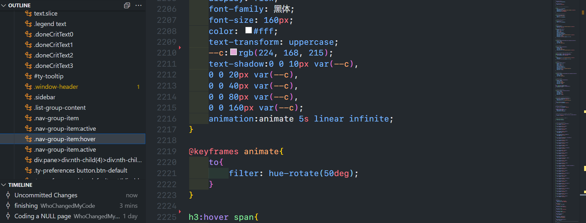
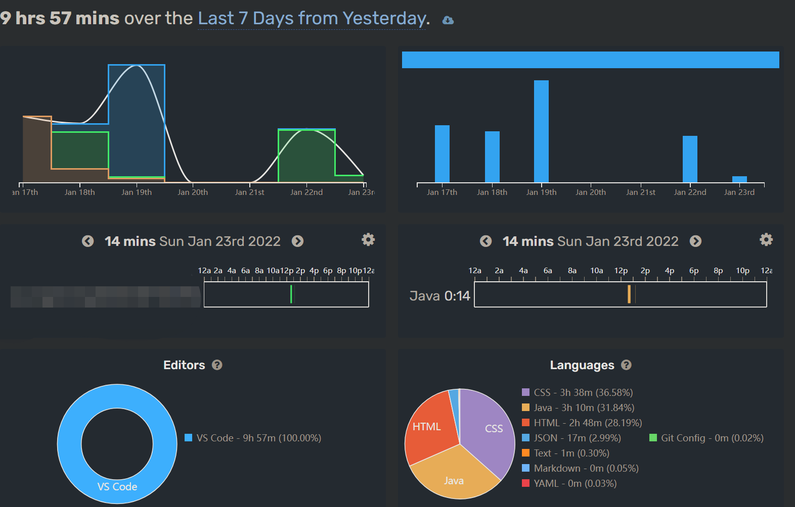
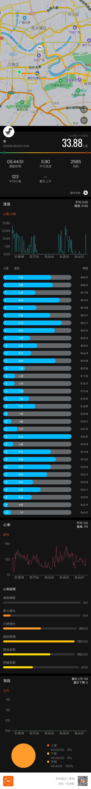

# Part One

**2022年1月23日**

> 前幾天天氣不好就在家Coding一個不存在的網頁，上綫公網一分鐘又被我撤了，遇事不決······

> 昨天天氣挺好，下午戶外二十多度，回南天，正是出去運動的好時機

> 快過年了，路上行人少

# Part Two

> 好久沒來五象總部基地，遙想當時讀書還是到處工地，當然現在也還是有一些地方在建設······

> 廣西體育中心

> 熟悉的路口，準備到母校

> 母校稍加修改了大門
> 過去同門衛吹水，學校明天就放寒假，加之如今爲了防空疫情，不能進校參觀，可惜

> 校門口馬路對岸的嘗不忘和蘭州拉麵還在

> 留校不回家的時候就是用校園卡來這續命

> 不能進校就在附近偷拍宿舍樓🤣
> 碰巧聽到上課鈴聲，懷念

> 當時讀書地鐵還沒通到五象，放假回家一般坐公交車，當然也可以打的，騎車或者步行(但是除了我這種有心情的七仔，誰愿意步行回家🤣🤣)

# Part Three

> 臨近傍晚，來到邕江兩岸的江濱公園騎行，對岸就是南寧市的龍脈—–青秀山，以前是叫青山
>
> 山脚下是青環路，青環路旁就是孔廟，也就是照片右下角，高三時的成人禮就在那舉行，關於那次成人禮，還有好多有趣的故事🤣，限於篇幅就不展開

> 曬太陽，眯一個鐘

> 最後還是被釣魚佬的魚竿鈴聲吵醒
> 釣魚佬就是這樣哦，飯不吃，老婆不管，就知道釣魚🤣🤣🤣

> 傍晚時分的南寧大橋
> 看來看去還是南寧大橋靚❤️

> 附張網圖，十年變遷

> “山氣日夕佳，飛鳥相與還”

> 繼續往下游走到五象大橋
> 上橋過對岸⏩

# Part Four

> 解決困難的方法就是直面困難

> [紀念毛澤東在邕江冬泳🔗](https://www.sohu.com/a/222453701_495023)的冬泳亭
> 人少不開燈，黑咪媽媽

> 比我老得多的邕江大橋

> 橋下的江濱公園，快過年也沒啥人，也不開燈

# Part Five

> 邕江大橋 · 光影

> 舊的南寧圖書館，現已停用，高中時期寒暑假就是來這學習

> 白沙大道 · 光影
>
> 已經是夜晚近十點，快到家了

# Part Six

> 到家才發現手環因誤觸提前結束了數據記錄
> 導致後半段沒數據
> 可惜

---
<footer>
Made by WhoChangedMyCode
</footer>